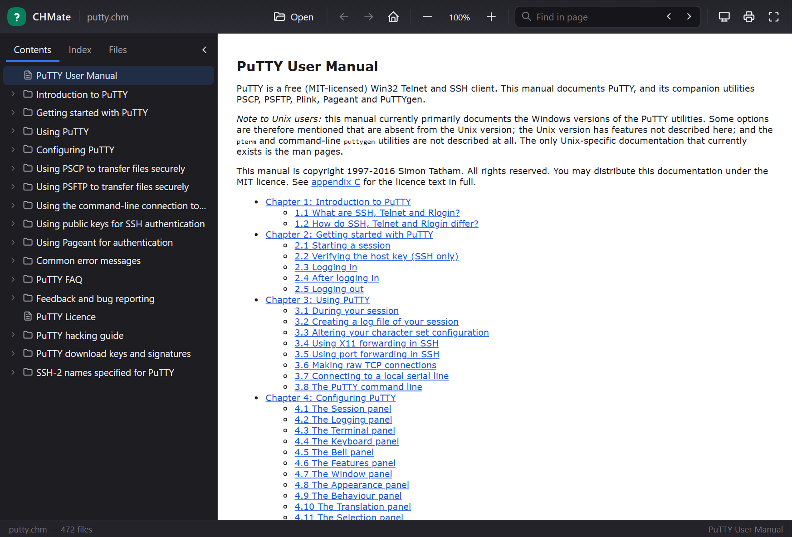
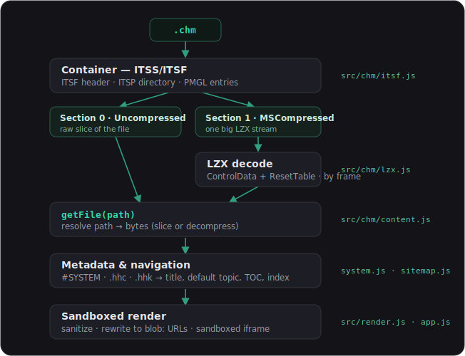

# CHMate

**A pure-JavaScript reader for Microsoft Compiled HTML Help (`.chm`) files — like PDF.js, but for `.chm`.**
No plugins, no native modules, no WASM. It parses the ITSS/ITSF container and
decompresses LZX entirely in JavaScript, then renders each Help topic in a
strictly sandboxed iframe.

<p align="center">
  <a href="https://alpaq92.github.io/CHMate/"></a>
</p>

### ▶ Live demo

**https://alpaq92.github.io/CHMate/** — open a `.chm` from your machine (it
never leaves the browser) or load the bundled PuTTY manual. Deployed
automatically from `main` via GitHub Actions ([`.github/workflows/pages.yml`](.github/workflows/pages.yml)).

---

## Features

- **Pure JS** — ITSF/ITSP/PMGL container parser and an LZX decompressor with
  ResetTable seeking, all in plain ES modules. No build step, no dependencies.
- **Faithful decoding** — validated byte-for-byte against 13 real `.chm` files
  (1,400+ internal files), including PuTTY's 270 KB manual and Windows system
  Help files.
- **Modern dark reader UI** — Contents / Index / Files sidebar, history
  (back/forward), zoom, find-in-page, print, drag-and-drop, keyboard shortcuts.
- **Security first** — every untrusted topic is sanitized and rendered inside a
  fully `sandbox`ed iframe with a strict Content-Security-Policy; scripts are
  stripped out, internal resources are served from in-memory `blob:` URLs, and
  the network is blocked so a hostile CHM can't phone home.
- **Works offline** and as a tiny library or CLI in Node.

## Run it locally

ES modules can't load over `file://`, so use the bundled dev server:

```bash
node tools/serve.mjs          # → http://localhost:8080
# or: npm start
```

Then open <http://localhost:8080> and pick a `.chm`.

## Use as a library

```js
import { ChmReader } from './src/chm/chm-reader.js';

const reader = ChmReader.open(arrayBuffer);   // Uint8Array or ArrayBuffer
reader.title;            // "PuTTY User Manual"
reader.defaultTopic;     // "/index.html"
reader.listFiles();      // ["/index.html", "/chapter1.html", ...]
reader.getFile(path);    // Uint8Array
reader.getText(path);    // decoded with the right charset
reader.getContents();    // table-of-contents tree (from the .hhc)
reader.getIndex();       // index tree (from the .hhk)
```

## CLI

```bash
node cli.mjs info    file.chm
node cli.mjs list    file.chm
node cli.mjs toc     file.chm
node cli.mjs cat     file.chm /index.html
node cli.mjs extract file.chm ./out
```

## How a CHM is read

<p align="center"></p>

The only genuinely hard part of CHM is **LZX** decompression. CHMate's LZX
decoder is an original implementation written from scratch against Microsoft's
published [\[MS-PATCH\] LZX specification](https://learn.microsoft.com/en-us/openspecs/windows_protocols/ms-patch/) —
all of CHMate is original MIT code, and no third-party decoder is shipped. See
[CREDITS.md](CREDITS.md).

## Tests

```bash
npm test          # validates samples/*.chm by self-consistency
node test/run.mjs path/to/other.chm
```

CHM files carry no checksums, so the suite proves correctness by
self-consistency: every entry must decompress to exactly its declared length
and, where the type is known, carry valid magic bytes / text. Any LZX error
turns this into garbage that fails instantly.

## Security notes

CHM is a legacy *and* an active malware vector. CHMate treats every topic as
hostile:

- rendered in `<iframe sandbox="allow-same-origin">` — **no** `allow-scripts`,
  so content JavaScript never runs;
- a strict CSP (`default-src 'none'`; only `blob:`/`data:` for images, styles,
  fonts) blocks all network access;
- `<script>`, event-handler attributes and `javascript:`/`vbscript:`/`ms-its:`
  URLs are stripped;
- internal images/stylesheets are rewritten to in-memory `blob:` URLs sourced
  from inside the CHM; external `url()`s in CSS are dropped; links are
  intercepted by the host and external ones require confirmation;
- nested `<frame>`/`<iframe>` content is itself recursively sanitized and given
  its own CSP (never loaded as raw HTML), so a frameset can't smuggle in a
  network beacon.

## License

MIT — see [LICENSE](LICENSE) and [CREDITS.md](CREDITS.md).
